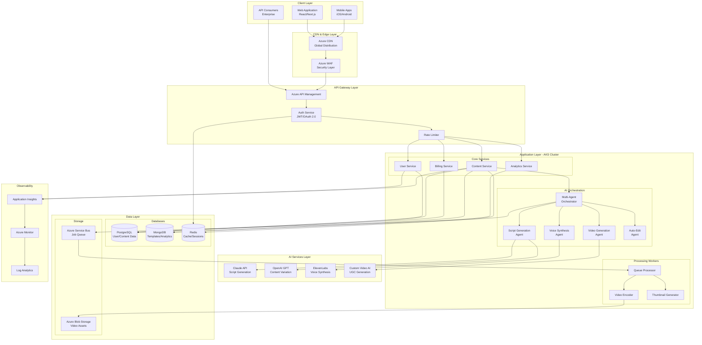
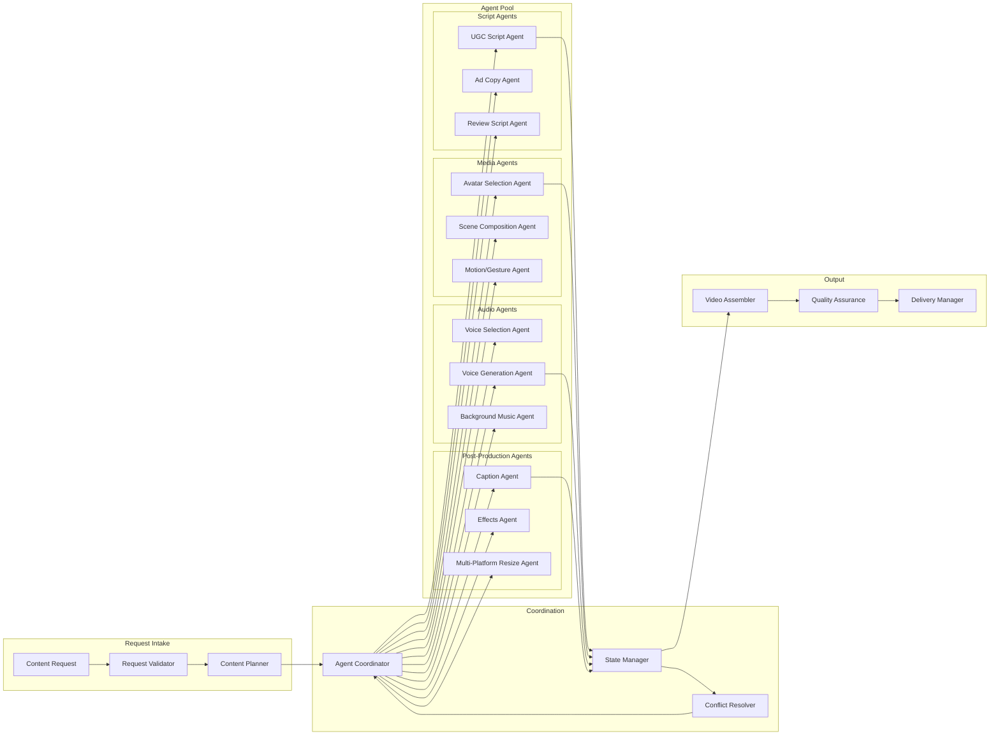
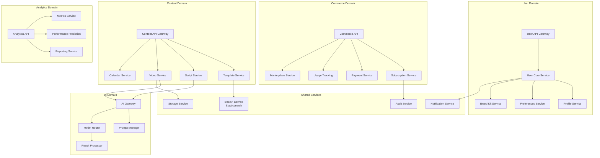
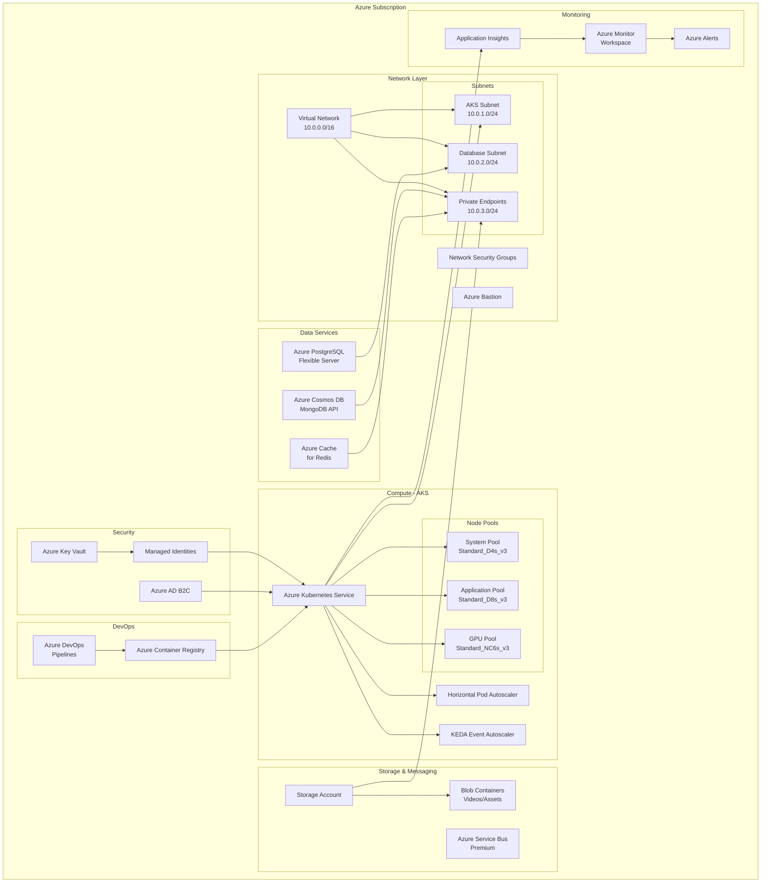
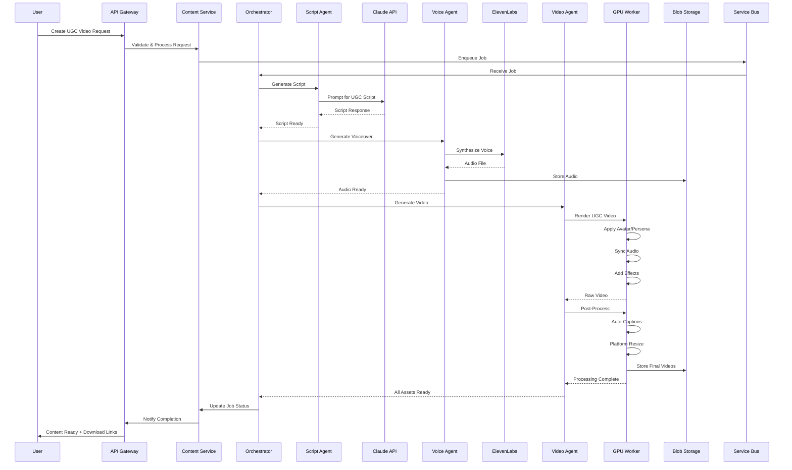
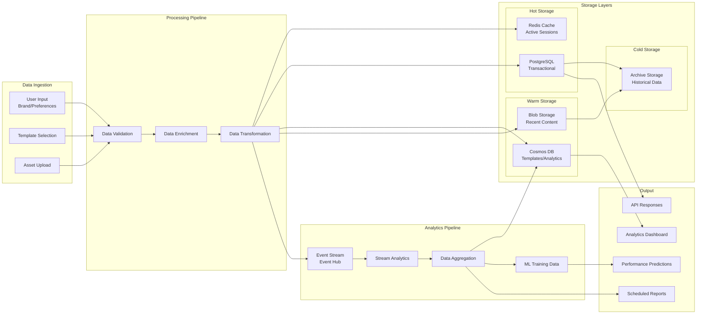
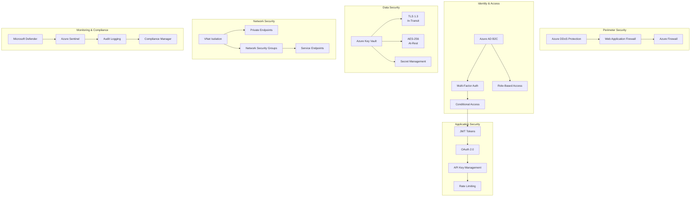
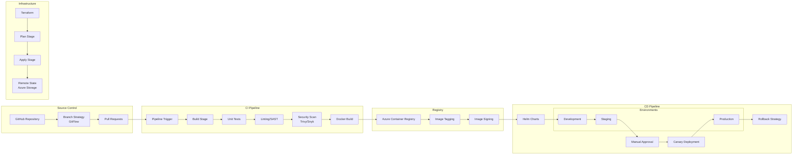
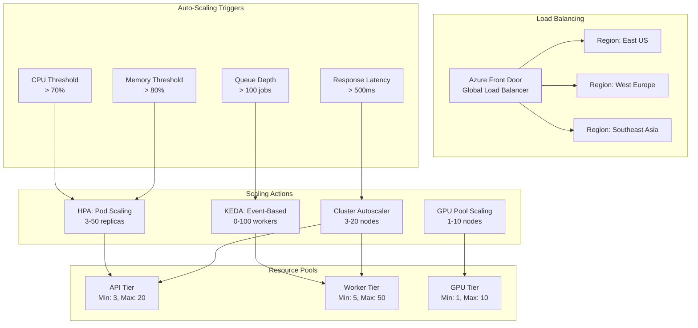
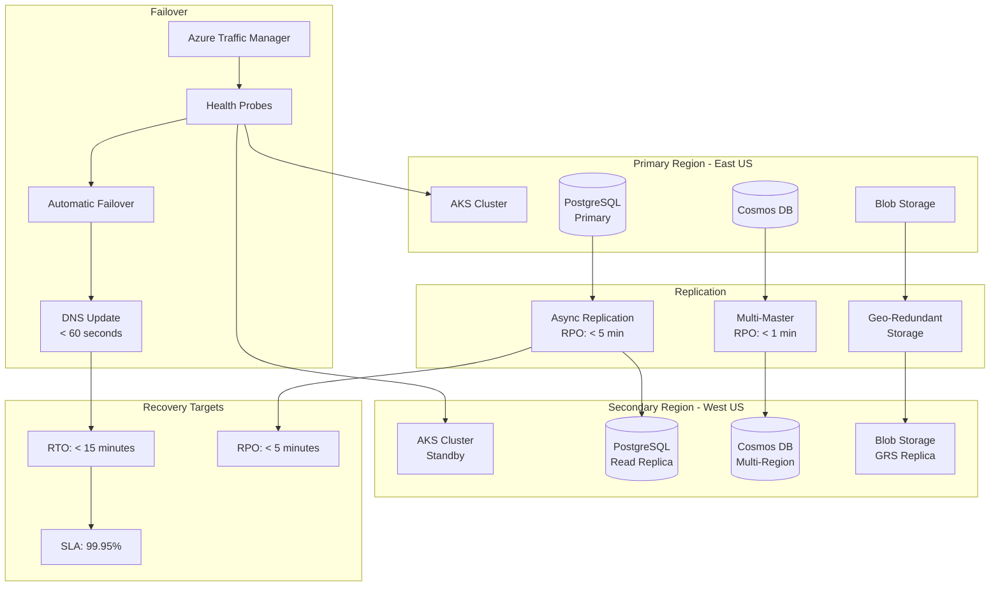

# UGC Creator Studio - System Architecture

## Executive Architecture Overview

This document outlines the complete technical architecture for the AI-Powered UGC Content Creation SaaS Platform, designed for scalability, security, and high-performance content generation.

---

## 1. High-Level System Architecture

---

## 2. Multi-Agent Content Orchestration Architecture

---

## 3. Microservices Architecture Detail

---

## 4. Azure Infrastructure Architecture

---

## 5. Video Generation Pipeline

---

## 6. Data Flow Architecture

---

## 7. Security Architecture

---

## 8. CI/CD Pipeline Architecture

---

## 9. Scalability Architecture

---

## 10. Disaster Recovery Architecture

---

## Architecture Decision Records

### ADR-001: Multi-Agent Orchestration Pattern
**Decision:** Implement autonomous AI agents with a central coordinator.  
**Rationale:** Enables parallel content generation, reduces processing time by 60%, allows specialized optimization per content type.

### ADR-002: Azure Kubernetes Service
**Decision:** Use AKS with dedicated GPU node pools.  
**Rationale:** Provides container orchestration, native Azure integration, cost-effective GPU scaling for video rendering.

### ADR-003: Event-Driven Architecture
**Decision:** Use Azure Service Bus for job queuing with KEDA autoscaling.  
**Rationale:** Handles bursty workloads, ensures reliable job processing, enables zero-to-scale worker patterns.

### ADR-004: Polyglot Persistence
**Decision:** PostgreSQL for transactions, Cosmos DB for templates/analytics, Redis for caching.  
**Rationale:** Optimizes each data type for its access pattern, balances consistency and performance requirements.

### ADR-005: Multi-Region Active-Passive
**Decision:** Primary region with warm standby for DR.  
**Rationale:** Achieves 99.95% SLA with cost-effective disaster recovery, supports global user base expansion.

---

## Component Specifications

| Component | Technology | Specifications |
|-----------|------------|----------------|
| API Gateway | Azure API Management | Premium tier, 99.95% SLA |
| Compute | AKS 1.28+ | 3 node pools, 50+ pods |
| GPU Workers | NC6s_v3 | NVIDIA Tesla V100, 16GB |
| Primary Database | PostgreSQL 15 | 8 vCores, 64GB RAM |
| Document Store | Cosmos DB | 10K RU/s, MongoDB API |
| Cache | Redis Enterprise | 6GB, P1 tier |
| Storage | Blob Storage | Hot tier, GRS replication |
| Message Queue | Service Bus | Premium, 1000 msg/s |
| CDN | Azure Front Door | Standard tier, global PoPs |

---

*Document Version: 1.0*  
*Last Updated: December 2024*  
*Architecture Owner: Platform Engineering Team*
