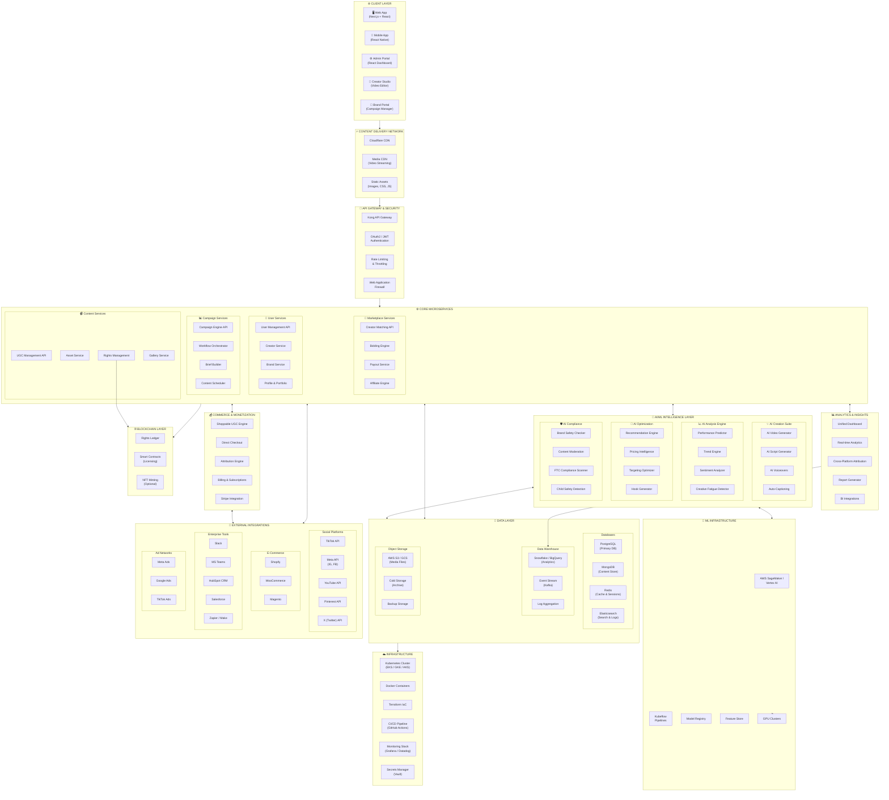

# NEXUS Platform

## System Architecture Diagram

---

## High-Level Architecture Overview

The NEXUS platform is built on a modern, cloud-native microservices architecture designed for scalability, resilience, and rapid feature development.



---

## Architecture Layers

### 1. Client Layer
- **Web Application:** Next.js 14+ with React 18, TypeScript, TailwindCSS
- **Mobile Application:** React Native for iOS and Android
- **Creator Studio:** Browser-based video editor with FFmpeg.wasm
- **Brand Portal:** Campaign management and analytics dashboard
- **Admin Portal:** Internal administration and content moderation

### 2. CDN & Edge Layer
- **Cloudflare CDN:** Global content delivery with DDoS protection
- **Media CDN:** HLS/DASH video streaming with adaptive bitrate
- **Static Assets:** Cached images, CSS, JavaScript bundles

### 3. API Gateway & Security
- **Kong Gateway:** API routing, load balancing, service discovery
- **Authentication:** OAuth 2.0, JWT tokens, social login providers
- **Rate Limiting:** Per-user and per-endpoint throttling
- **WAF:** Web Application Firewall for attack prevention

### 4. Core Microservices
- **User Services:** Authentication, profiles, permissions
- **Content Services:** UGC management, asset processing, rights tracking
- **Campaign Services:** Workflow automation, scheduling, brief management
- **Marketplace Services:** Creator matching, bidding, payments

### 5. AI/ML Layer
- **Creation Suite:** Video generation, script writing, voiceovers
- **Analysis Engine:** Performance prediction, sentiment analysis, trend detection
- **Optimization:** Recommendations, pricing intelligence, targeting
- **Compliance:** Brand safety, content moderation, FTC compliance

### 6. Commerce Layer
- **Shoppable UGC:** Product tagging, galleries, video commerce
- **Checkout:** Direct purchase flow without redirects
- **Attribution:** Multi-touch revenue attribution modeling
- **Billing:** Stripe integration for subscriptions and marketplace fees

### 7. Data Layer
- **PostgreSQL:** Primary relational database for transactions
- **MongoDB:** Document store for content metadata
- **Redis:** Caching, sessions, real-time data
- **Elasticsearch:** Full-text search and log aggregation
- **Snowflake/BigQuery:** Data warehouse for analytics

### 8. ML Infrastructure
- **SageMaker/Vertex AI:** Model training and deployment
- **Kubeflow:** ML pipeline orchestration
- **Feature Store:** Centralized feature management
- **GPU Clusters:** NVIDIA A100 for training and inference

### 9. Integrations
- **Social Platforms:** TikTok, Meta, YouTube, Pinterest, X
- **E-Commerce:** Shopify, WooCommerce, Magento, BigCommerce
- **Enterprise Tools:** Slack, Teams, HubSpot, Salesforce, Zapier
- **Ad Networks:** Meta Ads, Google Ads, TikTok Ads

### 10. Infrastructure
- **Kubernetes:** Container orchestration (EKS/GKE/AKS)
- **Terraform:** Infrastructure as Code provisioning
- **CI/CD:** GitHub Actions with ArgoCD for GitOps
- **Monitoring:** Datadog APM, Grafana dashboards, PagerDuty alerts

### 11. Blockchain Layer
- **Rights Ledger:** Immutable content licensing records
- **Smart Contracts:** Automated licensing agreements
- **NFT Minting:** Optional creator content tokenization

---

## Data Flow

```
User Request → CDN → API Gateway → Auth → Service → Database
                                      ↓
                                   AI Layer → ML Infrastructure
                                      ↓
                               Response → CDN → User
```

## Key Design Principles

1. **Microservices Architecture:** Independent, deployable services
2. **API-First Design:** Every capability exposed via REST/GraphQL
3. **Event-Driven:** Kafka for async communication between services
4. **Cloud-Native:** Kubernetes for orchestration and scaling
5. **AI-Integrated:** ML capabilities embedded in core workflows
6. **Multi-Tenant:** Isolated workspaces for brands and agencies

---

*Document Version: 1.0*
