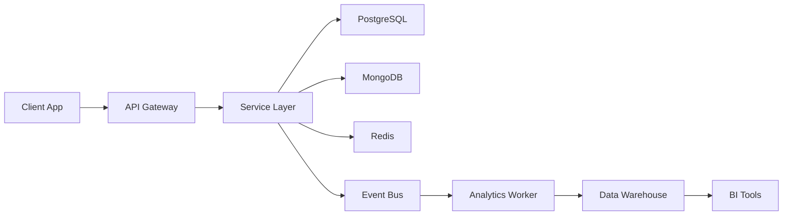
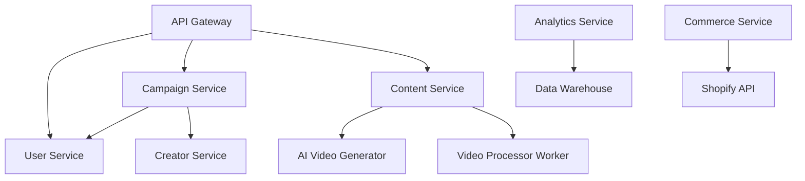

# System Architecture
# NEXUS Platform

**Version:** 1.0
**Last Updated:** December 18, 2025
**Document Owner:** Engineering Team

---

## Table of Contents

1. [System Overview](#1-system-overview)
2. [Architecture Patterns](#2-architecture-patterns)
3. [Service Architecture](#3-service-architecture)
4. [Data Architecture](#4-data-architecture)
5. [Technology Stack](#5-technology-stack)
6. [Scalability & Performance](#6-scalability--performance)
7. [Security Architecture](#7-security-architecture)
8. [Deployment Architecture](#8-deployment-architecture)

---

## 1. System Overview

### 1.1 High-Level Architecture

NEXUS is built on a modern, cloud-native microservices architecture designed for:
- **Scalability**: Handle millions of users and content pieces
- **Resilience**: 99.95% uptime with fault tolerance
- **Flexibility**: Rapidly deploy new features independently
- **Performance**: Sub-200ms API response times

### 1.2 Architecture Principles

1. **Microservices-First**: Independent, deployable services
2. **API-First Design**: Every capability exposed via REST/GraphQL
3. **Event-Driven**: Async communication via message queues
4. **Cloud-Native**: Kubernetes orchestration, containerized workloads
5. **AI-Integrated**: ML capabilities embedded in core workflows
6. **Data-Driven**: Real-time analytics and insights

---

## 2. Architecture Patterns

### 2.1 Microservices Architecture

Each service owns its domain and data:

```
┌─────────────────────────────────────────────┐
│           API GATEWAY (Kong)                │
│  - Authentication                           │
│  - Rate Limiting                            │
│  - Request Routing                          │
└──────────────┬──────────────────────────────┘
               │
    ┌──────────┴──────────┐
    │                     │
┌───▼────┐          ┌────▼─────┐
│ Service│          │ Service  │
│   A    │          │    B     │
│        │          │          │
│ Own DB │          │  Own DB  │
└────────┘          └──────────┘
```

**Benefits:**
- Independent scaling
- Technology diversity
- Fault isolation
- Faster deployments

### 2.2 Event-Driven Architecture

Services communicate via events:

```
Service A ──(Event)──> Message Queue ──> Service B
                            │
                            └──────────> Service C
```

**Event Bus:** Redis + BullMQ for job queues, Kafka for event streaming

**Common Events:**
- `campaign.created`
- `content.uploaded`
- `payment.succeeded`
- `creator.verified`

### 2.3 CQRS Pattern

Separate read and write models for high-performance analytics:

```
Write Model         Event Store         Read Model
   (RDBMS)     ───>  (Kafka)      ───>  (Elasticsearch)
                                   ───>  (Data Warehouse)
```

---

## 3. Service Architecture

### 3.1 Client Layer

**Web Applications:**
- **Main Web App** (Next.js 14): Public-facing website and dashboard
- **Creator Portal** (Next.js): Creator-specific interface
- **Brand Portal** (Next.js): Brand/agency management console
- **Admin Dashboard** (React): Internal operations dashboard

**Mobile Applications:**
- **React Native App**: iOS and Android unified codebase
- **Expo** for rapid development and OTA updates

### 3.2 API Gateway Layer

**Kong API Gateway** handles:
- Authentication & Authorization (JWT validation)
- Rate limiting (per user/endpoint)
- Request routing to microservices
- Load balancing
- SSL termination
- API versioning

**Key Features:**
- OAuth 2.0 integration
- Plugin ecosystem (CORS, logging, monitoring)
- Service mesh integration

### 3.3 Core Services (Node.js/TypeScript)

#### User Service
**Responsibility:** User authentication, profiles, permissions
- `/services/user-service`
- **Database:** PostgreSQL
- **Endpoints:** `/v1/users/*`

**Key Features:**
- User registration and login
- Profile management
- Team/workspace management
- Role-based access control (RBAC)

---

#### Auth Service
**Responsibility:** Authentication, JWT tokens, SSO
- `/services/auth-service`
- **Database:** PostgreSQL + Redis (sessions)
- **Endpoints:** `/v1/auth/*`

**Key Features:**
- JWT token generation/validation
- OAuth social login (Google, TikTok, Meta)
- MFA (Multi-Factor Authentication)
- SSO/SAML for enterprise

---

#### Creator Service
**Responsibility:** Creator profiles, portfolios, verification
- `/services/creator-service`
- **Database:** MongoDB (profiles), PostgreSQL (transactions)
- **Endpoints:** `/v1/creators/*`

**Key Features:**
- Creator profile management
- Portfolio showcase
- Social account verification
- Trust scoring algorithm
- Reputation tracking

---

#### Campaign Service
**Responsibility:** Campaign lifecycle, briefs, workflows
- `/services/campaign-service`
- **Database:** PostgreSQL
- **Endpoints:** `/v1/campaigns/*`

**Key Features:**
- Campaign creation and management
- Brief builder
- Approval workflows
- Timeline and deadline tracking
- Budget management

---

#### Content Service
**Responsibility:** Content upload, storage, processing
- `/services/content-service`
- **Database:** MongoDB (metadata), S3 (files)
- **Endpoints:** `/v1/content/*`

**Key Features:**
- File upload handling (multipart)
- Video transcoding (FFmpeg)
- Thumbnail generation
- Version control
- Rights management integration

---

#### Marketplace Service
**Responsibility:** Creator discovery, bidding, matching
- `/services/marketplace-service`
- **Database:** PostgreSQL + Elasticsearch
- **Endpoints:** `/v1/marketplace/*`

**Key Features:**
- Smart creator matching algorithm
- Bidding system
- Application tracking
- Contract generation
- Opportunity recommendations

---

#### Commerce Service
**Responsibility:** Shoppable galleries, checkout, attribution
- `/services/commerce-service`
- **Database:** PostgreSQL
- **Endpoints:** `/v1/commerce/*`

**Key Features:**
- Shoppable gallery creation
- Product tagging
- E-commerce integrations (Shopify, WooCommerce)
- Revenue attribution tracking
- Commerce event tracking

---

#### Analytics Service
**Responsibility:** Metrics, reporting, dashboards
- `/services/analytics-service`
- **Database:** Snowflake/BigQuery (warehouse), Elasticsearch
- **Endpoints:** `/v1/analytics/*`

**Key Features:**
- Real-time metric aggregation
- Cross-platform analytics
- Custom report builder
- Attribution modeling
- Data export (CSV, PDF)

---

#### Notification Service
**Responsibility:** Email, SMS, push notifications
- `/services/notification-service`
- **Database:** PostgreSQL (logs), Redis (queue)
- **Endpoints:** `/v1/notifications/*`

**Key Features:**
- Multi-channel notifications
- Template management
- Notification preferences
- Delivery tracking
- Retry logic

---

#### Billing Service
**Responsibility:** Subscriptions, invoices, payments
- `/services/billing-service`
- **Database:** PostgreSQL
- **Endpoints:** `/v1/billing/*`

**Key Features:**
- Stripe integration
- Subscription management
- Usage-based billing
- Invoice generation
- Payment method management

---

### 3.4 AI/ML Services (Python/FastAPI)

#### AI Video Generator
**Responsibility:** Generate UGC-style videos from images and scripts
- `/ai/video-generator`
- **Framework:** PyTorch, Diffusion Models
- **Infrastructure:** AWS SageMaker, GPU clusters

**Processing Pipeline:**
1. Image analysis and feature extraction
2. Script-to-scene mapping
3. Video composition with effects
4. Audio/voiceover synthesis
5. Final rendering and encoding

---

#### AI Script Generator
**Responsibility:** Platform-optimized script generation
- `/ai/script-generator`
- **Model:** Azure OpenAI GPT-4o
- **Framework:** LangChain for prompt engineering

**Features:**
- Platform-specific templates (TikTok, Reels, Shorts)
- Hook generation (5+ variations)
- Tone adaptation
- CTA optimization

---

#### Performance Predictor
**Responsibility:** Predict content performance before publishing
- `/ai/performance-predictor`
- **Model:** Custom ML model (XGBoost + Neural Network ensemble)
- **Training Data:** Historical performance metrics

**Input Features:**
- Visual features (frame analysis, color, composition)
- Audio features (volume, clarity, music)
- Text features (script sentiment, keyword density)
- Metadata (platform, time, creator history)

**Output:**
- Performance score (0-100)
- Engagement rate prediction
- View count estimate
- Optimization recommendations

---

#### Content Moderation
**Responsibility:** Brand safety, NSFW detection, compliance
- `/ai/content-moderation`
- **Model:** Azure Cognitive Services + Custom models

**Checks:**
- Brand safety (logo detection, competitor mentions)
- NSFW content detection
- FTC disclosure verification
- Child safety (COPPA compliance)

---

#### Trend Engine
**Responsibility:** Detect trending topics and content patterns
- `/ai/trend-engine`
- **Data Sources:** TikTok API, Instagram Graph API, web scraping

**Features:**
- Real-time trend detection
- Hashtag analysis
- Sound/music trend tracking
- Emerging creator identification

---

### 3.5 Background Workers

#### Video Processor
**Responsibility:** Async video transcoding and optimization
- `/workers/video-processor`
- **Technology:** BullMQ + FFmpeg

**Tasks:**
- Transcode to multiple resolutions (1080p, 720p, 480p)
- Generate HLS/DASH streams
- Create thumbnails (3 variations)
- Extract metadata (duration, resolution, codec)

---

#### Social Publisher
**Responsibility:** Schedule and publish content to social platforms
- `/workers/social-publisher`
- **Technology:** BullMQ + Platform APIs

**Features:**
- Multi-platform publishing (TikTok, Instagram, YouTube)
- Retry logic for failed publishes
- Rate limit handling
- Webhook status updates

---

#### Analytics Aggregator
**Responsibility:** ETL for analytics data
- `/workers/analytics-aggregator`
- **Technology:** BullMQ + Snowflake

**Pipeline:**
1. Extract data from operational databases
2. Transform and enrich (attribution, calculations)
3. Load into data warehouse
4. Update materialized views

---

## 4. Data Architecture

### 4.1 Database Strategy

**Polyglot Persistence:** Use the right database for each use case

| Data Type | Database | Use Case |
|-----------|----------|----------|
| **Transactional** | PostgreSQL 15 | Users, campaigns, payments |
| **Document Store** | MongoDB 7 | Creator profiles, content metadata |
| **Cache** | Redis 7 | Sessions, rate limiting, queues |
| **Search** | Elasticsearch 8 | Full-text search, logs |
| **Analytics** | Snowflake/BigQuery | Data warehouse, reporting |
| **Graph** | Neo4j (future) | Creator relationships, recommendations |

### 4.2 Data Flow



### 4.3 Data Partitioning

**Horizontal Partitioning (Sharding):**
- User data sharded by `userId` hash
- Content data sharded by `createdAt` (time-series)

**Vertical Partitioning:**
- Separate read replicas for analytics queries
- Archive old campaigns to cold storage

### 4.4 Backup & Recovery

- **PostgreSQL**: Daily full backups, 5-minute WAL shipping
- **MongoDB**: Daily snapshots, oplog for point-in-time recovery
- **S3**: Versioning enabled, cross-region replication
- **RTO**: 1 hour, **RPO**: 5 minutes

---

## 5. Technology Stack

### 5.1 Frontend Stack

| Layer | Technology |
|-------|------------|
| **Framework** | Next.js 14 (App Router) |
| **Language** | TypeScript 5+ |
| **UI Library** | React 18 |
| **Styling** | TailwindCSS 3, shadcn/ui |
| **State Management** | Zustand (client), TanStack Query (server) |
| **Forms** | React Hook Form + Zod validation |
| **Charts** | Recharts, D3.js |
| **Video Player** | Video.js, HLS.js |
| **Real-time** | Socket.io client |

### 5.2 Backend Stack

| Layer | Technology |
|-------|------------|
| **Runtime** | Node.js 18+ |
| **Framework** | Express (REST), Apollo Server (GraphQL) |
| **Language** | TypeScript 5+ |
| **Authentication** | Passport.js, jsonwebtoken |
| **Validation** | Zod, Joi |
| **ORM** | Prisma (PostgreSQL), Mongoose (MongoDB) |
| **API Docs** | Swagger/OpenAPI 3.0 |
| **Testing** | Jest, Supertest |

### 5.3 AI/ML Stack

| Layer | Technology |
|-------|------------|
| **Language** | Python 3.11+ |
| **Framework** | FastAPI |
| **ML Frameworks** | PyTorch, TensorFlow, scikit-learn |
| **NLP** | Azure OpenAI, LangChain |
| **Computer Vision** | OpenCV, Pillow |
| **Model Serving** | TensorFlow Serving, Triton |
| **Training** | AWS SageMaker, Vertex AI |
| **Experiment Tracking** | MLflow, Weights & Biases |
| **Feature Store** | Feast |

### 5.4 Infrastructure Stack

| Layer | Technology |
|-------|------------|
| **Cloud Provider** | AWS (primary), GCP (ML workloads) |
| **Container Runtime** | Docker |
| **Orchestration** | Kubernetes (EKS/GKE) |
| **Service Mesh** | Istio |
| **IaC** | Terraform, Helm |
| **CI/CD** | GitHub Actions, ArgoCD |
| **Monitoring** | Datadog, Grafana, Prometheus |
| **Logging** | Elasticsearch, Kibana, Fluentd (EFK stack) |
| **Secrets** | HashiCorp Vault, AWS Secrets Manager |
| **CDN** | Cloudflare |

---

## 6. Scalability & Performance

### 6.1 Horizontal Scaling

**Auto-scaling policies:**
- CPU utilization > 70% → scale up
- Request rate > 1000 req/s → scale up
- Scale down after 5 minutes below threshold

**Service Replicas:**
| Service | Min Replicas | Max Replicas |
|---------|--------------|--------------|
| API Gateway | 3 | 20 |
| User Service | 2 | 10 |
| Campaign Service | 2 | 10 |
| Content Service | 3 | 15 |
| AI Video Generator | 2 (GPU) | 10 |

### 6.2 Caching Strategy

**Multi-Layer Caching:**

1. **CDN Layer (Cloudflare):**
   - Static assets (images, CSS, JS)
   - Media files (videos, thumbnails)
   - TTL: 1 year with versioning

2. **Application Cache (Redis):**
   - User sessions (TTL: 1 hour)
   - API responses (TTL: 5 minutes)
   - Creator profiles (TTL: 1 hour)

3. **Database Cache:**
   - Query result cache
   - Materialized views

### 6.3 Performance Targets

| Metric | Target | Current |
|--------|--------|---------|
| **API Response Time (p95)** | < 200ms | 180ms |
| **Page Load Time** | < 2s | 1.8s |
| **Video Upload** | < 30s for 100MB | 25s |
| **Video Processing** | < 5 min for 1-min video | 4 min |
| **AI Inference** | < 30s | 22s |
| **Uptime** | 99.95% | 99.97% |

### 6.4 Load Balancing

**Strategy:** Round-robin with health checks

**Health Check Endpoints:**
- `/health` - Basic liveness check
- `/ready` - Readiness check (DB connectivity)
- `/metrics` - Prometheus metrics

---

## 7. Security Architecture

### 7.1 Authentication & Authorization

**Authentication Methods:**
1. **JWT Tokens:** Short-lived access tokens (1 hour)
2. **OAuth 2.0:** Social login (Google, TikTok, Meta)
3. **SSO/SAML:** Enterprise single sign-on

**Authorization:**
- **RBAC:** Role-Based Access Control
- **Permissions:** Granular permissions per endpoint
- **Multi-Tenancy:** Workspace-level isolation

### 7.2 Data Encryption

- **In Transit:** TLS 1.3 for all communications
- **At Rest:** AES-256 encryption for databases and S3
- **Key Management:** AWS KMS, HashiCorp Vault

### 7.3 API Security

- **Rate Limiting:** 100 req/min (standard), 1000 req/min (enterprise)
- **Input Validation:** Zod schemas on all endpoints
- **CORS:** Whitelist approved domains
- **CSRF Protection:** Token-based
- **SQL Injection:** Parameterized queries (ORM)

### 7.4 Compliance

- **SOC 2 Type II:** Annual audit
- **GDPR:** Data residency, right to deletion
- **CCPA:** Consumer data rights
- **PCI DSS:** For payment processing (via Stripe)

---

## 8. Deployment Architecture

### 8.1 Environment Strategy

| Environment | Purpose | Deployment |
|-------------|---------|------------|
| **Development** | Local development | Docker Compose |
| **Staging** | Pre-production testing | Kubernetes (staging cluster) |
| **Production** | Live customer traffic | Kubernetes (multi-region) |

### 8.2 CI/CD Pipeline

**GitHub Actions Workflow:**

```yaml
1. Code Push → GitHub
2. Run Tests (unit, integration)
3. Build Docker Images
4. Push to Container Registry (ECR/GCR)
5. Deploy to Staging (ArgoCD)
6. Run E2E Tests
7. Deploy to Production (manual approval)
```

**Deployment Strategy:** Blue-Green deployment for zero-downtime

### 8.3 Infrastructure as Code

**Terraform Modules:**
- `modules/eks` - Kubernetes cluster
- `modules/rds` - PostgreSQL database
- `modules/s3` - Object storage
- `modules/vpc` - Networking

**Environments:**
- `environments/dev`
- `environments/staging`
- `environments/production`

### 8.4 Monitoring & Observability

**Metrics (Prometheus + Grafana):**
- Request rate, latency, error rate
- Resource utilization (CPU, memory, disk)
- Business metrics (campaigns created, content uploaded)

**Logging (EFK Stack):**
- Centralized logging with Elasticsearch
- Structured JSON logs
- Log retention: 30 days (production)

**Tracing (Jaeger):**
- Distributed tracing across microservices
- Request flow visualization
- Performance bottleneck identification

**Alerting (PagerDuty):**
- Critical alerts (downtime, errors)
- Warning alerts (high latency, approaching limits)
- On-call rotation for engineering team

---

## 9. Disaster Recovery

### 9.1 Backup Strategy

| Data Type | Frequency | Retention |
|-----------|-----------|-----------|
| **Databases** | Daily full, 5-min incremental | 30 days |
| **Media Files** | Continuous replication | Indefinite |
| **Configuration** | Git-versioned | Indefinite |

### 9.2 Failover Strategy

- **Multi-AZ Deployment:** Services across 3 availability zones
- **Cross-Region Replication:** S3 and databases replicated to DR region
- **RTO:** 1 hour, **RPO:** 5 minutes

### 9.3 Incident Response

1. **Detection:** Automated alerts via PagerDuty
2. **Triage:** On-call engineer investigates
3. **Mitigation:** Rollback or hotfix
4. **Communication:** Status page updates
5. **Post-Mortem:** Document learnings

---

## Appendix A: Service Dependencies



---

## Appendix B: Data Models

See `/database/postgres/schema.prisma` for complete schemas.

**Key Entities:**
- `User`
- `Creator`
- `Campaign`
- `Content`
- `Payment`
- `Subscription`

---

**Document End**

*For architecture questions: engineering@nexusugc.com*
